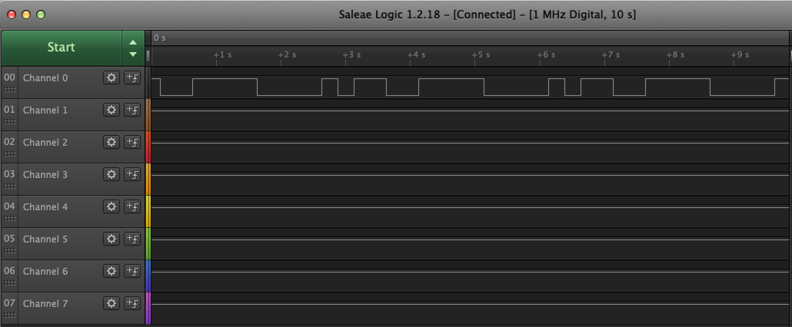
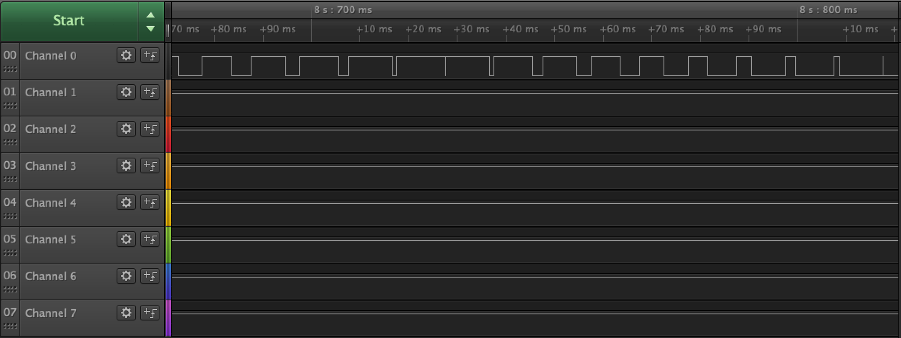
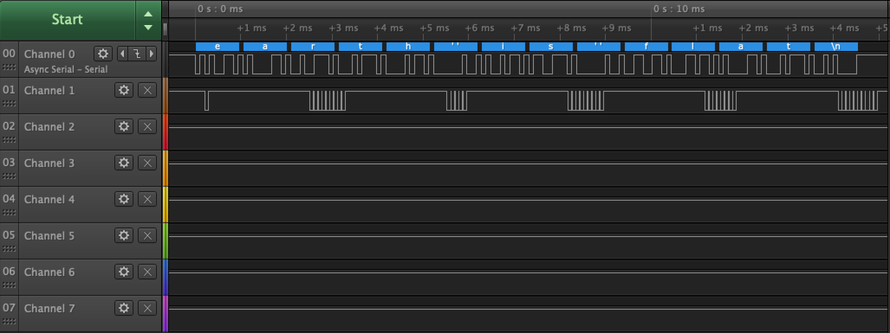
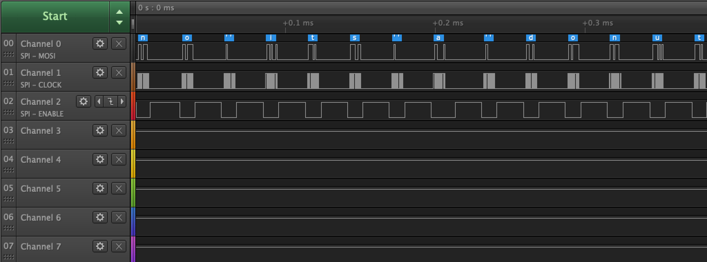

Name: Jonathan (Trace) Hamada

EID: jth3238

Team Number: F7

## Questions

1. Why does your program need a setup and a loop?

    The setup is necessary to initialize pins on the board in order to use them and the loop is needed to run the code over and over again.

2. What is the downside to putting all your code in a loop?

    It would be inefficent to out all the code in a loop rather than calling subroutines when necessary.

3. Why does your code need to be compiled?

    The code neeeds to be compiled so that the code is converted to machine code and is understood by the Arduino.

4. When lowering the frequency in procedure A, step 4, what is going wrong? Brainstorm some solutions. Dimmers exist in the real world. What is their solution?

    The frequency is too short so the LED fluctuations are visible. To solve this problem and not hurt people with epilepsy, the frequency should be higher so the fluctuations are not visible to the human eye.

5. Why do you need to connect the logic analyzer ground to the ESP32 ground?

    In order for the logic analyzer to get a correct reading, the ground must be consistent with that of the Arduino board.

6. What is the difference between synchronous and asynchronous communication?

    Synchronous communication is where multiple components communicate with each other and will not function until they recieve communication from the other while asynchronous is where a component will send a message to another but the other component is not actively waiting for said message.

7. Profile of UART: Sent X bytes in Y time 

    Sent 14 bytes in 14.963ms

8. Profile of SPI: Sent X bytes in Y time

    Sent 15 bytes in 0.407ms

9. Why is SPI so much faster than UART?

    SPI is faster than UART because it uses synchronous communication, waiting for a response and immediately sending a reply, as opposed to UART which uses asynchronous communication.

10. list one pro and one con of UART

    Because UART uses asynchronous communication, it does not wait for a message and does not have a master-slave connection so the con of this is that it is slower but the pro of this is that it can do multiple actions at the same time and is not hung up waiting for a message.

11. list one pro and one con of SPI

    The SPI is faster because it uses synchronous communication but it also has to wait for a message to arrive so there is a lot of waiting time.

12. list one pro and one con of I2C

    I2C is also synchronous but is simpler than SPI but is slower than SPI.

13. Why does I2C need external resistors to work?

    I2C needs external resistors for pull-up of the line to Vcc.

## Screenshots

Procedure A, step 1:

Procedure A, step 4:

Procedure B, UART:

Procedure B, SPI:

